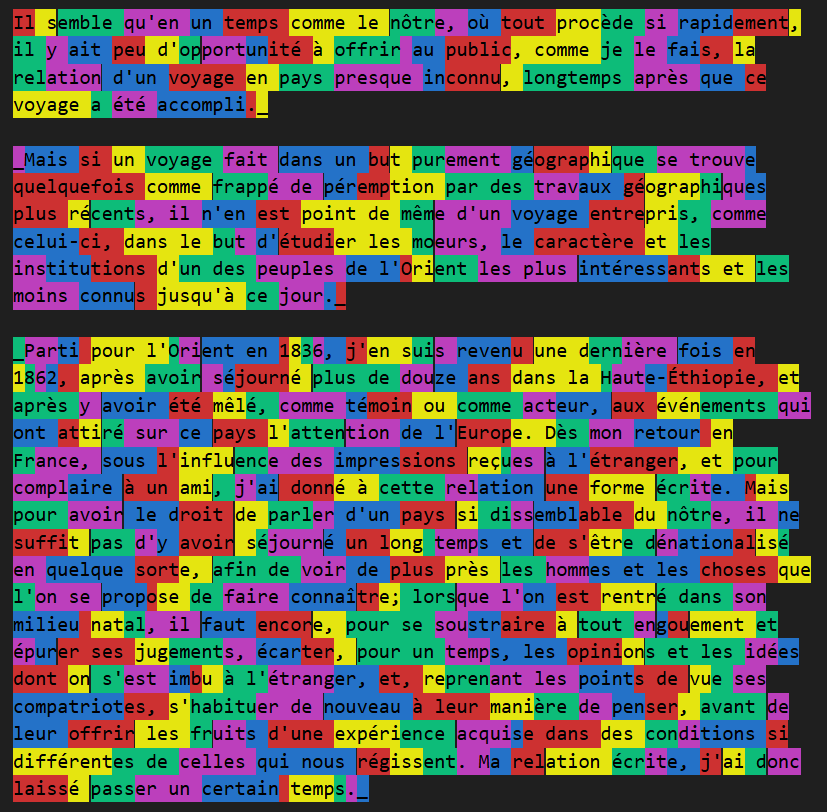

An Byte-pair_encoding iterator.

Based and inspired by :

[The Byte Pair Encoding technique](https://en.wikipedia.org/wiki/Byte-pair_encoding)
and
[OpenAI ChatGPT BPE Tiktoken](https://github.com/openai/tiktoken/).

Given some text, detect the most common pair of char/string and merge them together.
At the beginning in this exemple (french language), the most detected pair are :

```
// "<morphene to merge>" x<frequency>
"e " x35194
"s " x28838
"t " x19935
... // later :
"pendant " x115
"qui, " x114
"très-" x114
"ères " x114
"et de " x114
"enf" x114
"eur, " x113
"ress" x113
"erg" x113
"aires " x113
```

This code is designed in an efficiant way to avoid memory allocation and useless iteration. It took ~ 4 seconds max on my computer to tokenize the text. (I didn't do any benchmark, just to give an idea) 

Sometime I use the term Tokenization, sometime the term [Morphemization](https://en.wikipedia.org/wiki/Morpheme).

Exemple on ["Douze ans de séjour dans la Haute-Éthiopie"](input/18812.txt) bt Arnauld d' Abbadie, provided by the [Project Gutenberg](input/credit.md).

